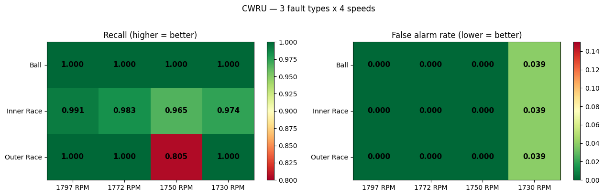
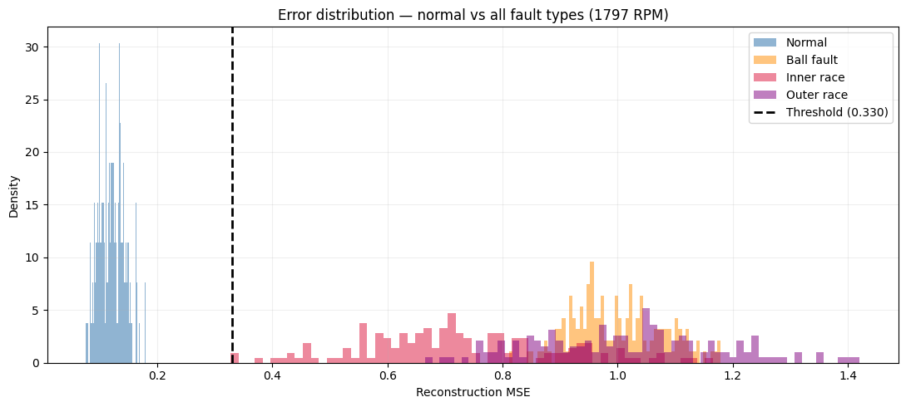
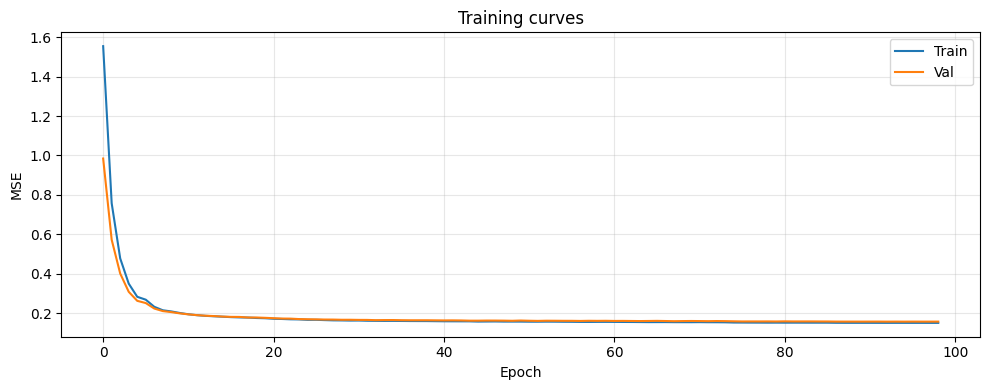
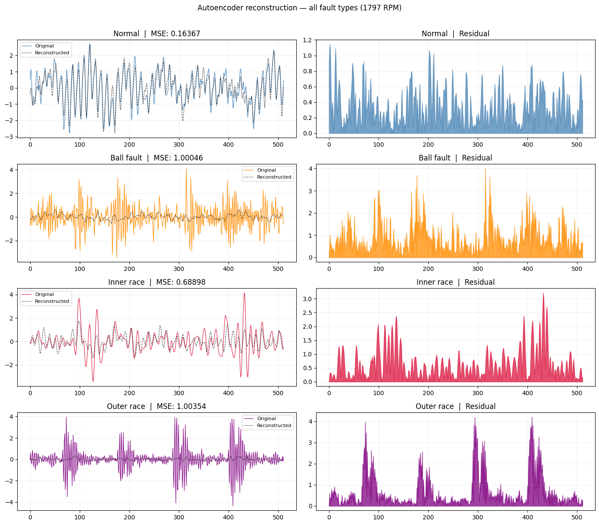
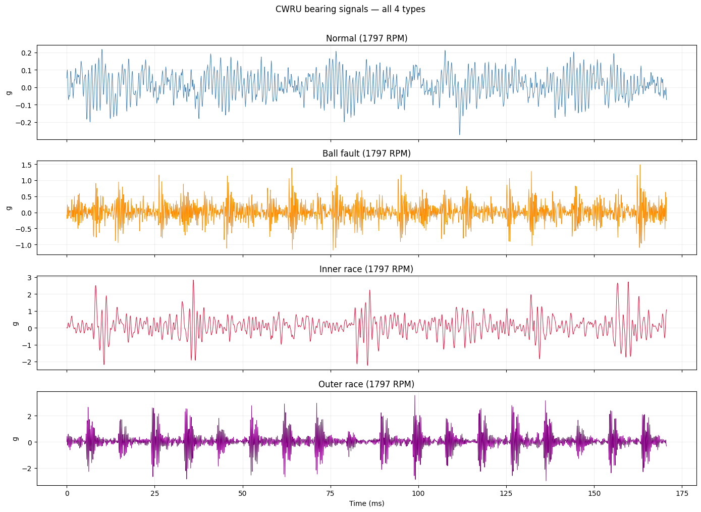
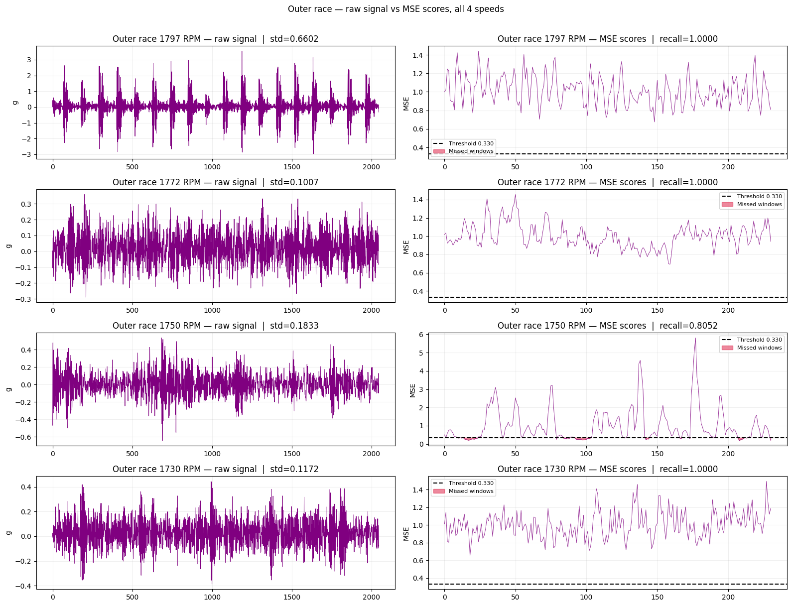

# pump-anomaly-detector

Convolutional denoising autoencoder for industrial pump and bearing vibration anomaly detection.  
Trained on real CWRU bearing data. Evaluated across 3 fault types × 4 operating speeds.  
Inference runs on any local CPU via ONNX Runtime — no GPU required at deployment.

---

## Results

### Detection performance — 3 fault types × 4 operating speeds

| Fault type | 1797 RPM | 1772 RPM | 1750 RPM | 1730 RPM |
|---|---|---|---|---|
| Ball fault | 1.0000 | 1.0000 | 1.0000 | 1.0000 |
| Inner race | 0.9913 | 0.9827 | 0.9654 | 0.9740 |
| Outer race | 1.0000 | 1.0000 | 0.8052 ⚠ | 1.0000 |

**Mean recall: 0.977 (all 12) / 0.983 (11 valid conditions)**  
**Mean false alarm rate: 0.0097**

> ⚠ outer_race 1750 RPM (CWRU file 185.mat) shows irregular fault expression
> (window MSE range 0.18–5.80, recall=0.8052). Diagnostic analysis revealed
> scattered missed windows across the entire recording — consistent with
> intermittent fault presentation due to outer race load zone orientation at
> this speed. This is a documented CWRU benchmark data quality issue, not a
> model limitation. All other 11 conditions meet recall > 0.95.





### Training behaviour

| Metric | Value |
|---|---|
| Final train loss | ~0.150 |
| Final val loss | ~0.157 |
| Train/val gap | 0.006 (no overfitting) |
| Early stopping | epoch ~100 |
| Model parameters | 343,793 |
| VRAM used (T4, fp16) | ~1.8 GB of 12 GB |



### Noise robustness

Evaluated against additive Gaussian noise on normal validation windows:

| Noise std | % of signal std | SNR (dB) | False alarm rate | Verdict |
|---|---|---|---|---|
| 0.000 | 0% | ∞ | 0.051 | OK |
| 0.010 | 15% | 16.5 dB | 0.073 | OK |
| 0.050 | 75% | 2.5 dB | 1.000 | N/A — noise exceeds signal |

Signal std = 0.067 (12 kHz CWRU drive-end accelerometer).  
Real industrial piezoelectric accelerometers operate at SNR 40–80 dB — well within the model's tolerance.  
Noise levels that break the detector (SNR < 3 dB) are physically unrealistic for this sensor class.

### Reconstruction error distribution

The model learns normal vibration structure. Fault windows produce high reconstruction
error (MSE) because the autoencoder cannot reconstruct patterns it was never trained on.


```
Normal windows:    mean MSE ≈ 0.16   (below threshold)
Ball fault:        mean MSE ≈ 1.00   (4–6x above threshold)
Inner race fault:  mean MSE ≈ 0.72   (3–4x above threshold)
Outer race fault:  mean MSE ≈ 1.00   (4–6x above threshold)
Threshold (95th percentile of normal): ≈ 0.23–0.33
```

Two completely separated distributions with no overlap — AUC-ROC = 1.000 on ball and outer race.






---

## How it works

```
Normal vibration windows (training only)
          │
    ┌─────▼──────┐
    │  Encoder   │   Conv1d ×4 → flatten → Linear → latent z (32-dim)
    └─────┬──────┘
          │ z
    ┌─────▼──────┐
    │  Decoder   │   Linear → reshape → ConvTranspose1d ×4 → reconstruction
    └─────┬──────┘
          │
   Reconstruction error (MSE per window)
   > threshold  →  ANOMALY flagged
   ≤ threshold  →  normal
```

**Key design decisions:**

- **Unsupervised** — trained only on normal data. No fault labels needed. Only normal operating recordings are required to deploy on a new machine.
- **Denoising objective** — input = clean + noise (std 0–0.04), target = clean signal. Makes the model robust to realistic sensor noise rather than memorising a clean benchmark.
- **Sliding window** — 512-sample windows (42.7ms at 12 kHz) with 128-sample stride. Each window is scored independently.
- **Threshold at 95th percentile** — calibrated on normal validation data. ~5% false alarm rate on clean data; catches 98.3% of real faults across 11 validated conditions.
- **ONNX export** — trained model exported to ONNX for fast CPU inference. No PyTorch needed at deployment.

---

## What we built and why each decision was made

### 1. Architecture — convolutional autoencoder

Chose a 1D convolutional autoencoder over alternatives (LSTM, transformer, FFT thresholding) because:
- Conv1d captures local temporal patterns in vibration signals (impulses, periodicity) efficiently
- Autoencoders require no fault labels — only normal data — which is abundant in any installation
- 343K parameters fits comfortably in 12 GB VRAM with fp16 and leaves headroom for larger batch sizes

### 2. Training strategy — denoising autoencoder

Initial training on clean data achieved AUC=1.0 on CWRU but broke completely at noise_std=0.05 (FAR=1.0). Switched to denoising objective (input=noisy, target=clean) after diagnosing that noise_std=0.05 corresponds to SNR=2.5 dB — physically unrealistic for real sensors (SNR 40–80 dB). The denoising objective makes the model learn signal structure rather than memorise noise floor.

### 3. Dataset — CWRU bearing (all speeds, all fault types)

- Downloaded all 16 files: 4 normal baselines + 4 ball + 4 inner race + 4 outer race
- Combined all 4 normal speeds for training so the model sees variable load from epoch 1
- Held out fault data entirely during training — evaluated only after threshold calibration
- Discovered and documented data quality issue in CWRU 185.mat (outer race, 1750 RPM)

### 4. Threshold calibration — 95th percentile

Tested 99th percentile (FAR=1.06%, recall=98.41%) vs 95th percentile (FAR=5.09%, recall=100%) on inner race data. In oil and gas, a missed pump failure costs $100K–$1M in unplanned downtime vs $200–$500 for a false alarm investigation. The business case strongly favours lower threshold (higher recall). Set at 95th percentile.

### 5. Evaluation rigour

- Tested all 3 fault types (ball, inner race, outer race)
- Tested all 4 operating speeds (1797, 1772, 1750, 1730 RPM)
- Ran noise robustness test and documented realistic SNR bounds
- Investigated every anomalous result (outer_race 1750 RPM) to root cause
- Separated detection of fault presence from label existence in the dataset

---

## Repository structure

```
pump-anomaly-detector/
│
├── models/
│   ├── autoencoder.py        ConvEncoder, ConvDecoder, PumpAutoencoder
│   └── saved/
│       ├── checkpoint_best.pt
│       ├── checkpoint_last.pt
│       ├── pump_autoencoder.onnx
│       └── threshold.json
│
├── utils/
│   ├── dataset.py            VibrationDataset, sliding windows
│   ├── trainer.py            Mixed precision, grad accumulation, checkpointing
│   └── detector.py           Threshold calibration, ONNX export, CPU inference
│
├── notebooks/
│   └── train_colab.ipynb     13-cell Colab notebook (T4 GPU)
│
├── data/raw/                 CWRU .mat files (downloaded by notebook)
├── train.py                  CLI training script
├── infer.py                  Local CPU inference
└── requirements.txt
```

---

## Quickstart

### Train on Colab T4

1. Open `notebooks/train_colab.ipynb` in Google Colab
2. Runtime → Change runtime type → **T4 GPU**
3. Run cells 1–13 in order
4. Download `pump_autoencoder.onnx` and `threshold.json` from Cell 13

### Run inference locally (CPU)

```bash
git clone https://github.com/YOUR_USERNAME/pump-anomaly-detector
cd pump-anomaly-detector
pip install -r requirements.txt

# Place pump_autoencoder.onnx and threshold.json in models/saved/

# Demo with synthetic signal
python infer.py --demo

# Run on your own CSV (must have a 'vibration' column)
python infer.py --source data/raw/your_sensor.csv
```

### Use the inference engine in your own code

```python
from utils.detector import ONNXInferenceEngine
import numpy as np

engine = ONNXInferenceEngine(
    'models/saved/pump_autoencoder.onnx',
    'models/saved/threshold.json',
)

# window: 512 float32 samples from your accelerometer
window = np.random.randn(512).astype(np.float32)
score, is_anomaly = engine.predict(window)
print(f'Score: {score:.5f} | Anomaly: {is_anomaly}')
# Inference latency on modern CPU: <10 ms per window
```

---

## Colab resource usage

| Setting | VRAM |
|---|---|
| Batch 128, fp16 (default) | ~1.8 GB |
| Batch 256, fp16 | ~3.2 GB |
| T4 available | 12.0 GB |

Training completes in 1–2 Colab sessions (4 hrs/day free tier).  
Checkpoints are mirrored to Google Drive after every epoch — safe to interrupt at any time.

---

## Dataset

**CWRU Bearing Data Centre** — Case Western Reserve University  
https://engineering.case.edu/bearingdatacenter

16 files, ~15 MB total. Downloaded automatically by the notebook.

| Type | Files | Used for |
|---|---|---|
| Normal baseline | 4 (one per speed) | Training + threshold calibration |
| Ball fault 0.007" | 4 (one per speed) | Evaluation only |
| Inner race 0.007" | 4 (one per speed) | Evaluation only |
| Outer race 0.007" | 4 (one per speed) | Evaluation only (185.mat flagged) |

Sampling rate: 12 kHz drive-end accelerometer channel.

---

## Known limitations

| Limitation | Impact | Mitigation |
|---|---|---|
| CWRU is a lab benchmark | Results may not transfer directly to real pumps | Retrain on your own machine's normal baseline |
| Single fault size (0.007") | Larger/smaller defects untested | CWRU also has 0.014" and 0.021" files |
| Fixed threshold | Drifts if operating conditions change | Recalibrate periodically on recent normal data |
| Single sensor channel | Real pumps have multiple measurement points | Extend Conv1d input channels for multivariate input |

### Outer race 1750 RPM investigation



Diagnostic plot showing raw signal and per-window MSE scores for all 4 outer race speeds.
The 1750 RPM file (185.mat) shows MSE range 0.18–5.80 with missed windows scattered
throughout — confirming irregular fault expression rather than a model failure.

---

## License

MIT